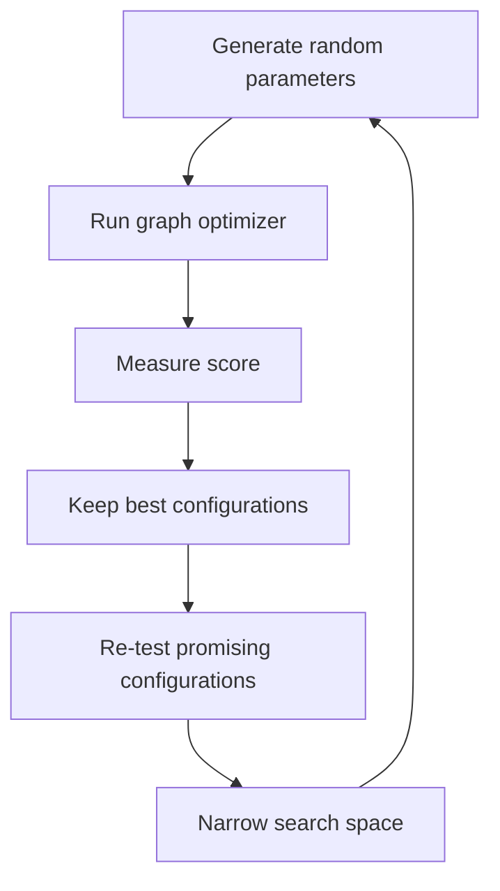

## Meta-optimizer

- The layout algorithm contains several parameters that strongly affect its behavior, such as force strengths, momentum, repulsion strength and iteration scheduling.

- Instead of tuning all of them manually, a separate meta-optimizer can be used to search for better parameter combinations automatically.

- The meta-optimizer works by generating many random parameter sets, testing them on the graph and comparing their resulting scores. Better-performing configurations are evaluated more times to reduce the influence of lucky random runs.

- After a number of iterations, the search space is gradually narrowed around the best-performing parameter regions. This allows the optimizer to start with broad exploration and later focus more on promising areas.

## In simplified form, the process looks like this:

Because the graph layout itself contains randomness, a single run is not always enough to judge whether a parameter set is actually good. For this reason, the meta-optimizer uses repeated benchmarks for the most promising configurations.

The goal of the meta-optimizer is not to find a mathematically perfect set of parameters, but to find values that produce consistently good layouts within a reasonable number of iterations.

